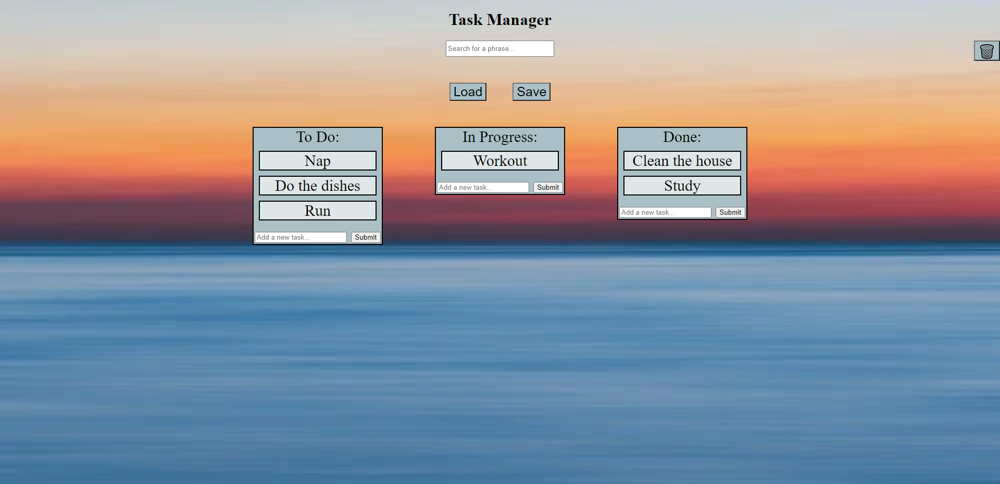

# Task Manager

## Description
You have a task manager. There are three lists: To Do, In Progress, Done. Add tasks to manage your task list, and move them between the different lists.

## Features

1. Use the field in every list and press "submit" to add a new task to the list. Each task will appear on top. Trying to submit an empty task will alert you to not do so.
2. To edit a task, double click it. A marker will appear- indicating the text is now changeable. Simply press enter or click outside to save your change.
3. If you want to move tasks between lists, put your mouse on a task, and press Alt+1/2/3, to move the task to another list. Alt+1 is for To do, and so on. Your task will move to the top of the new list.
4. Use the global search bar at the top to search for a phrase. All tasks containing the phrase will be displayed after every key press. Delete the phrase to display all your tasks again.
5. Your data saves every time you add a new task, edit, or move it! So don't be afraid to close the task manager and come back later. Your tasks will wait for you in the same place they did before.
6. Pressing save at the top will save your lists to an outer site. Pressing load will load the lists from that site, from the last time you saved them. A loader will indicate when the request is being handled. Once it's gone your lists are saved/loaded. So, if you want do edit your tasks, save them. And then, if you don't like your editing- press load and your lists will be updated to the last time you saved.
7. You can drag each task and switch it with other tasks in its list. Hold down your left mouse button on a task. That task will follow your mouse as long as you hold down the left mouse button. Hover over other tasks to see who you're replacing the task with- release the left mouse button to switch them.
8. The bin in the upper right part is for deleting all tasks. Clicking it will prompt you with two new buttons- yes and no, and a question: "Are you sure?". Clicking yes will delete all your tasks (not from the outer site though). Clicking no will revert the bin to its originial look and your tasks will remain as they were before. You should save your tasks (with the save button) before clicking the bin- that way if you regret it, you can load the tasks from the last time you saved them.

Here is how it looks like:

Link for the task manager:
https://ehoodgoren.github.io/kanban-final/solution/
